# the great stupid label misadventure

from the [2020-09-19 SUMAF Init](9a47x-1h6w9-ezapf-a1k6k-9a58m)

Trying to figure out why I can't resolve grafana.prometheus.internal... oh right

`kubectl annotate pods --all st8s.testtrack4.com/zone=403`

well, that's not it...

## ron howard narrator voice

that was it. except it's a label, not an annotation, and it applies to nodes, not pods.

## fumbling around trying to figure this out

well, you know, it looks like it's having trouble associating these to the default ingress? Because I haven't truly set one? Anyway, let's go ahead and set an "internal" ingress class on the contour spec, and set the kube-prometheus stack entries to use it

checking the logs for the external-dns pod... oh right. I have to manually configure the external-dns instance to connect to the coredns one, because there's no real other way without vendoring the chart in, this was a bug I noted when designing the chart

hmm, still not seeing anything... setting `logLevel: debug` and pushing a new release

```
time="2020-09-20T05:53:55Z" level=debug msg="No endpoints could be generated from ingress prometheus/kps-prometheus"
time="2020-09-20T05:53:55Z" level=debug msg="No endpoints could be generated from ingress prometheus/kps-alertmanager"
time="2020-09-20T05:53:55Z" level=debug msg="No endpoints could be generated from ingress prometheus/kube-prometheus-stack-grafana"
```

hmm, that's true. Why isn't Contour hooking these Ingresses up to the Envoy endpoint?

(I go ahead and push a new release that sets `logLevel: info`, then erase it from the manifest, so this way I know I won't have to worry about inadvertently not reverting to the default)

## inspecting contour

`kubectl -n household-system port-forward $(kubectl -n household-system get pod -l app.kubernetes.io/name=contour -o name | head -1) 6060`

`curl localhost:6060/debug/dag`:

```dot
digraph DAG {
rankdir="LR"
"0xc000a892c0" [shape=record, label="{listener|:80}"]
"0xc00102ed80" [shape=record, label="{http://alertmanager.prometheus.internal}"]
"0xc0013021e0" [shape=record, label="{prefix: /}"]
"0xc000ed2f50" [shape=record, label="{cluster|{prometheus/kps-alertmanager/9093/da39a3ee5e|weight 0}}"]
"0xc001009a20" [shape=record, label="{service|prometheus/kps-alertmanager:9093}"]
"0xc000ed2f50" -> "0xc001009a20"
"0xc0013021e0" -> "0xc000ed2f50"
"0xc00102ed80" -> "0xc0013021e0"
"0xc000a892c0" -> "0xc00102ed80"
"0xc00102ed60" [shape=record, label="{http://grafana.prometheus.internal}"]
"0xc001302140" [shape=record, label="{prefix: /}"]
"0xc000ed2ee0" [shape=record, label="{cluster|{prometheus/kube-prometheus-stack-grafana/80/da39a3ee5e|weight 0}}"]
"0xc001009970" [shape=record, label="{service|prometheus/kube-prometheus-stack-grafana:80}"]
"0xc000ed2ee0" -> "0xc001009970"
"0xc001302140" -> "0xc000ed2ee0"
"0xc00102ed60" -> "0xc001302140"
"0xc000a892c0" -> "0xc00102ed60"
"0xc00102eda0" [shape=record, label="{http://webui.prometheus.internal}"]
"0xc001302280" [shape=record, label="{prefix: /}"]
"0xc000ed2fc0" [shape=record, label="{cluster|{prometheus/kps-prometheus/9090/da39a3ee5e|weight 0}}"]
"0xc001009ad0" [shape=record, label="{service|prometheus/kps-prometheus:9090}"]
"0xc000ed2fc0" -> "0xc001009ad0"
"0xc001302280" -> "0xc000ed2fc0"
"0xc00102eda0" -> "0xc001302280"
"0xc000a892c0" -> "0xc00102eda0"
}
```



So it's definitely seeing the ingresses...

## this is what it looks like when you don't have an envoy on the IP you've reserved for it

Well, setting `192.168.32.0 grafana.prometheus.internal` in my local `/etc/hosts`...

```
[stuart@stushiba ~]$ curl grafana.prometheus.internal
curl: (7) Failed to connect to grafana.prometheus.internal port 80: No route to host
[stuart@stushiba ~]$ curl 192.168.32.0
curl: (7) Failed to connect to 192.168.32.0 port 80: No route to host
```

huh that's weird.

...hey wait a minute I don't see an envoy pod running at all

```
[stuart@stushiba ~]$ kubectl get ds -A
NAMESPACE          NAME                                             DESIRED   CURRENT   READY   UP-TO-DATE   AVAILABLE   NODE SELECTOR                  AGE
household-system   household-contour-envoy                          0         0         0       0            0           st8s.testtrack4.com/zone=403   3h51m
kube-system        kube-proxy                                       5         5         5       5            5           kubernetes.io/os=linux         4h10m
kube-system        weave-net                                        5         5         5       5            5           <none>                         4h3m
metallb-system     metallb-speaker                                  5         5         5       5            5           kubernetes.io/os=linux         3h52m
prometheus         kube-prometheus-stack-prometheus-node-exporter   5         5         5       5            5           <none>                         3h52m
rook-ceph          rook-discover                                    4         4         4       4            4           <none>                         3h51m
```

uhh

## here's where it hit me

oh GOD DAMNIT - i mistyped the annotation command earlier, hence why I didn't see any output when I ran it:

```
[stuart@stushiba ~]$ kubectl annotate nodes --all st8s.testtrack4.com/zone=403
node/stuby.403.testtrack4.com annotated
node/stumez.403.testtrack4.com annotated
node/stunster.403.testtrack4.com annotated
node/stuphire.403.testtrack4.com annotated
node/sturl.403.testtrack4.com annotated
```

## except "annotate" is not how you label a node

THERE we go. fucking hell

ughhh the daemonset still thinks it wants 0 nodes

let's try the old "`kubectl edit ds -n household-system household-contour-envoy` and just add a `foo=bar` annotation to jiggle the document"

nope. shit

...wait, I want this as a label, not an annotation.

## dingdingding winner

```
[stuart@stushiba ~]$ kubectl annotate nodes --all st8s.testtrack4.com/zone= --overwrite
node/stuby.403.testtrack4.com annotated
node/stumez.403.testtrack4.com annotated
node/stunster.403.testtrack4.com annotated
node/stuphire.403.testtrack4.com annotated
node/sturl.403.testtrack4.com annotated
[stuart@stushiba ~]$ kubectl label nodes --all st8s.testtrack4.com/zone=403
node/stuby.403.testtrack4.com labeled
node/stumez.403.testtrack4.com labeled
node/stunster.403.testtrack4.com labeled
node/stuphire.403.testtrack4.com labeled
node/sturl.403.testtrack4.com labeled
[stuart@stushiba ~]$ kubectl get ds -A
NAMESPACE          NAME                                             DESIRED   CURRENT   READY   UP-TO-DATE   AVAILABLE   NODE SELECTOR                  AGE
household-system   household-contour-envoy                          4         4         0       4            0           st8s.testtrack4.com/zone=403   4h7m
kube-system        kube-proxy                                       5         5         5       5            5           kubernetes.io/os=linux         4h26m
kube-system        weave-net                                        5         5         5       5            5           <none>                         4h18m
metallb-system     metallb-speaker                                  5         5         5       5            5           kubernetes.io/os=linux         4h8m
prometheus         kube-prometheus-stack-prometheus-node-exporter   5         5         5       5            5           <none>                         4h8m
rook-ceph          rook-discover                                    4         4         4       4            4           <none>                         4h7m
```

there we go

